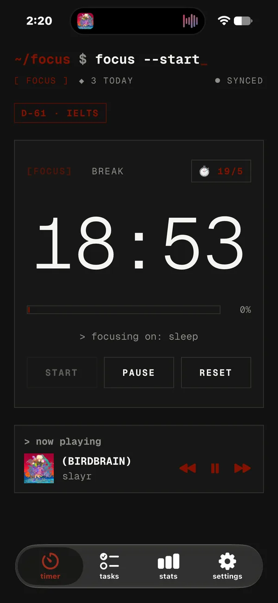
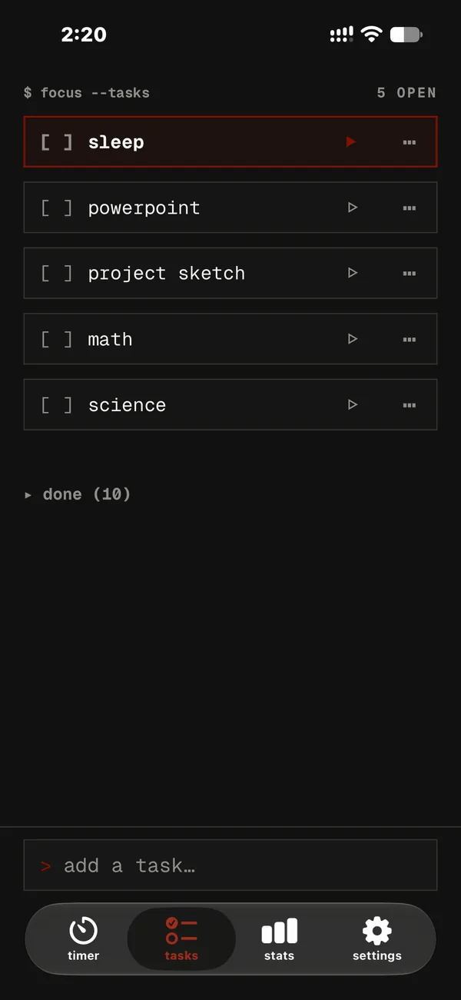
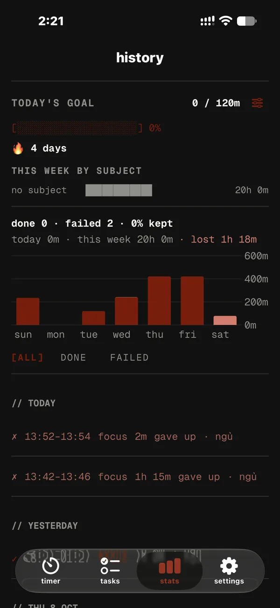
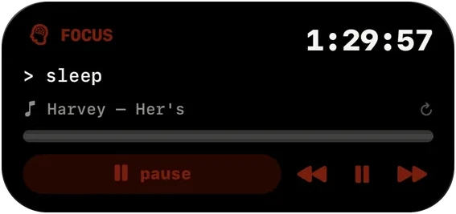
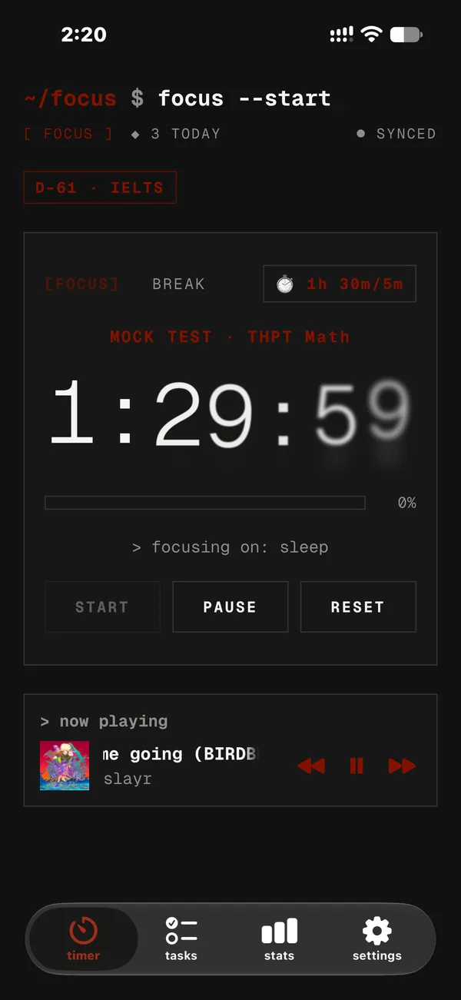
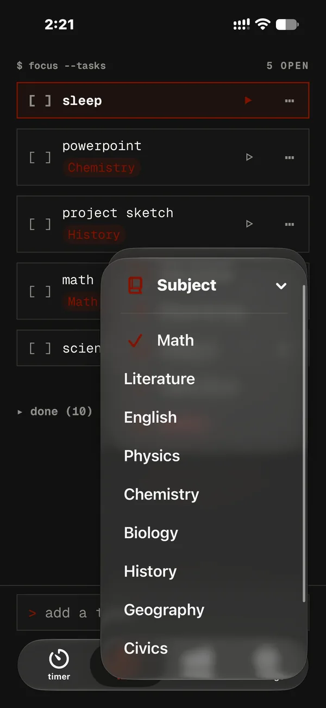
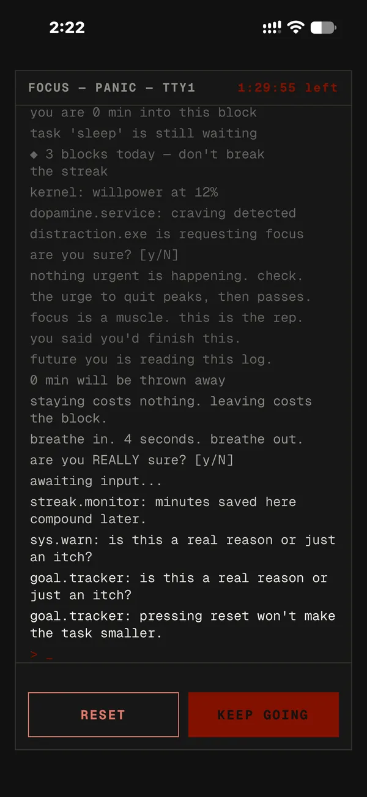
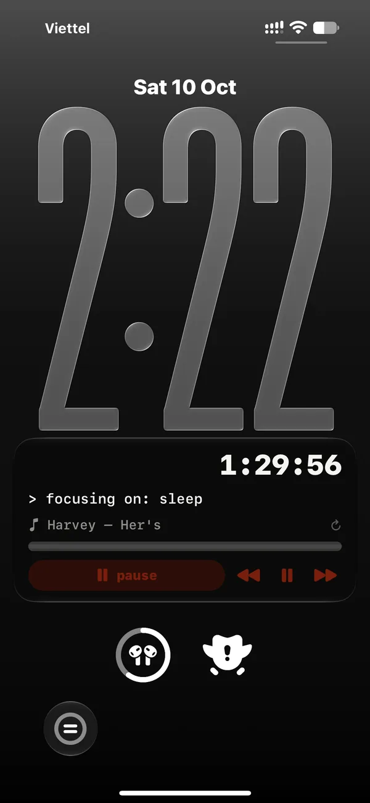
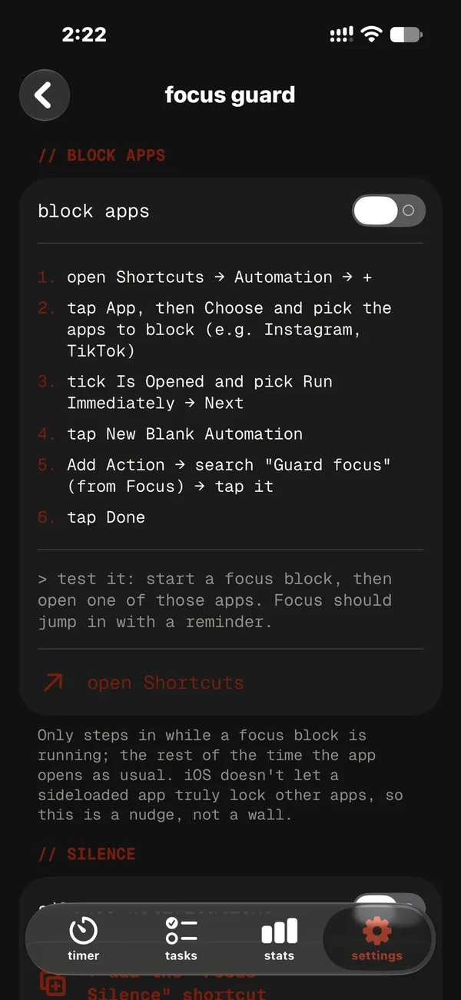
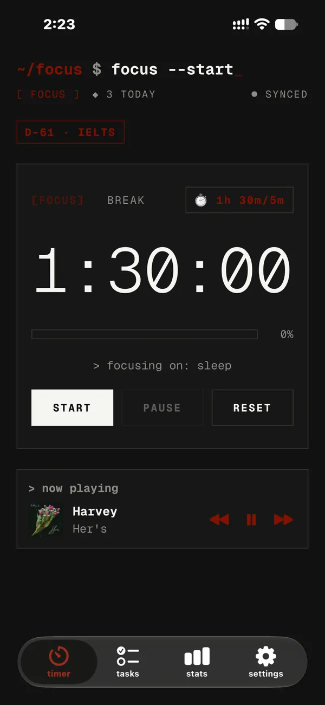

<p align="center">
  <a href="https://notanlee.github.io/"></a>
</p>

<p align="center">
  <a href="README.md"></a>
  <a href="README.vi.md"></a>
</p>

<h1 align="center">$ Focus</h1>

<p align="center">
  <b>A Pomodoro timer that looks like a terminal, and pushes back when you try to quit.</b><br>
  Built for students: exam countdowns, mock tests, subjects, study streaks.
</p>

<p align="center">
  <a href="https://github.com/notanlee/focus-timer/releases/latest"></a>
  <a href="https://github.com/notanlee/focus-timer/releases"></a>
  
  
  <a href="https://notanlee.github.io/"></a>
</p>

<p align="center">
  <a href="https://github.com/notanlee/focus-timer/releases/latest"><b>Download IPA</b></a> &nbsp;·&nbsp;
  <a href="https://notanlee.github.io/install.html"><b>Install guide</b></a> &nbsp;·&nbsp;
  <a href="https://notanlee.github.io/"><b>Website</b></a> &nbsp;·&nbsp;
  <a href="https://github.com/notanlee/focus-timer/releases">Release notes</a> &nbsp;·&nbsp;
  <a href="https://notanlee.github.io/privacy.html">Privacy</a> &nbsp;·&nbsp;
  <a href="https://notanlee.github.io/terms.html">Terms</a>
</p>

```console
~/focus $ focus --start
[ FOCUS ]  ◆ 3 today  · synced
D-45 · THPT            mock test · THPT Toán 90'
            1:29:59
[███░░░░░░░░░░░░░░░░░]  12%
> focusing on: ôn Toán chương 3      ♪ rain · 40%
```

<p align="center">
  
  
  
  
</p>

---

## Why $ Focus

- **It looks like a terminal.** Five styles (Mono, Cozy, PowerShell, CMD, Ubuntu), 20 mono fonts, each with its own boot screen, buttons and crash screen.
- **Quitting is hard on purpose.** Hold reset in the middle of a block and a panic screen talks you out of it. Give up anyway and it's logged as a fail.
- **It's made for studying.** Count down to THPT, IELTS or SAT, run timed mock tests, tag time by subject, and keep a daily-goal streak.
- **It lives on your lock screen.** Dynamic Island and Live Activity with pause, switch and music buttons.
- **It's free, with no ads and no account required.** Everything works offline; an account (6-digit email code) only backs up and syncs.

## What's new in 1.14

| | |
|---|---|
| **Exam countdown** | Add THPT Quốc gia, IELTS, SAT, VSAT/ĐGNL, finals or your own. The nearest shows as `D-45 · THPT`, with reminders a week and a day before. |
| **Mock-test timer** | Real exam lengths: THPT Toán 90', Văn 120', Anh 60'; IELTS L/R/W; SAT modules. Warnings 15' and 5' before time's up. |
| **Subjects & stats** | Tag tasks (Toán, Văn, Anh…). Stats shows a daily goal meter, a 🔥 streak and minutes per subject. |
| **Focus sounds** | Rain, ocean, fan, white/pink/brown noise, generated on the phone. Keeps playing on the lock screen and mixes with Spotify. |
| **New look** | Bottom tab bar (Timer · Tasks · Stats · Settings), softer and warmer colours, renamed to **$ Focus**. |

<p align="center">
  
  
  
  
</p>

## Everything it does

<table>
<tr>
<td width="50%" valign="top">

**Timer**
- Focus / break up to 8 hours each, set with hour/minute wheels or quick chips
- Your own presets, a ⏱ button on the timer card
- Hold to pause; hold longer to reset mid-focus → panic screen
- Sounds and Core Haptics for every action

**Tasks**
- Add from the bar pinned at the bottom
- ▷ to focus, ⋯ for subject / move to top / delete
- Finished tasks fold into "done (n)", drag to reorder

**Study**
- Exam countdown chip + reminders
- Mock-test timer with time-left warnings
- Subjects, daily goal, streak, per-subject minutes
- History of finished ✓ and given-up ✗ blocks

</td>
<td width="50%" valign="top">

**Lock screen & island**
- Live countdown in the Dynamic Island and on the lock screen
- Pause, switch focus ↔ break, ⏮ ⏯ ⏭ for Spotify
- Tap the song line to refresh it

**Focus guard**
- Block distracting apps during focus (via Shortcuts)
- Do Not Disturb on while you focus, off on breaks

**Connections**
- Spotify now-playing and controls
- Google Calendar logging of finished blocks
- Backup & sync with a 6-digit email code

**Make it yours**
- 5 terminal styles, 20 fonts, custom colours, matching app icons
- English and Tiếng Việt, everything translated

</td>
</tr>
</table>

<p align="center">
  
  
  
  
</p>

## Install

Focus isn't on the App Store; you sideload it with a free Apple ID.

1. **Download** the latest `FocusTimer-<version>-<build>.ipa` from [Releases](https://github.com/notanlee/focus-timer/releases/latest).
2. **Install** it with iloader or SideStore by following the [step-by-step install guide](https://notanlee.github.io/install.html) (Windows or Mac).
3. **Stay updated**: the app tells you when a new version is out. In SideStore, add this source for one-tap updates:

```
https://github.com/notanlee/focus-timer/releases/latest/download/source.json
```

> Requires iOS 26 or later. Free Apple ID installs last 7 days, then refresh them in iloader or SideStore.

## FAQ

<details>
<summary><b>Is it free?</b></summary>

Yes. No ads, no subscription, no in-app purchases.
</details>

<details>
<summary><b>Do I need an account?</b></summary>

No. Focus works fully offline as a guest. An optional account (sign in with a 6-digit email code) backs up your tasks and history and syncs them across devices.
</details>

<details>
<summary><b>Does it work offline?</b></summary>

Yes. Only sync, Spotify and Google Calendar need the internet.
</details>

<details>
<summary><b>Why does the song on the Dynamic Island sometimes lag?</b></summary>

iOS doesn't let sideloaded apps run in the background. Focus re-checks Spotify for about 30 seconds after you leave and whenever you tap an island button or the song line.
</details>

<details>
<summary><b>What data does it collect?</b></summary>

Only what it needs to sync your own tasks and sessions. Exams, goals, sounds and settings stay on your phone. See the [Privacy Policy](https://notanlee.github.io/privacy.html).
</details>

## Release notes

Every version is listed under [Releases](https://github.com/notanlee/focus-timer/releases) with what's new, changed and fixed, in English and Vietnamese.

## Feedback

Open an [issue](https://github.com/notanlee/focus-timer/issues), or message **Discord** `notanlee` / **TikTok** [`@notanlee1`](https://www.tiktok.com/@notanlee1).

## License

Copyright © 2026 An Le. All rights reserved ([LICENSE](LICENSE)). The app is free to download and use; the source code is private and may not be copied, modified or redistributed.

```bash
creator note:
hoi chieu....... hoio chieuuuuuuuuuuuuuuuuuuuuuuuuuuuuuuuuuuu t-t--t-t-t-t-t-t-t-tt-t-t-t-t-t-t-troi m-m-m--mm-m-m-m-m-m-mua
```
