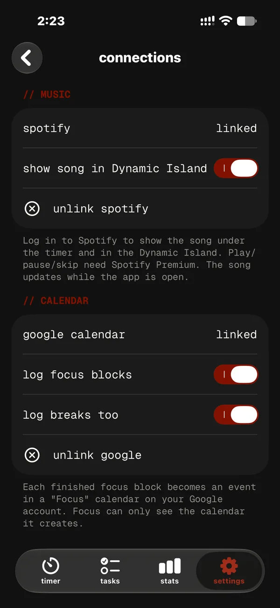

<p align="center">
  <a href="https://notanlee.github.io/"></a>
</p>

<p align="center">
  <b>A Pomodoro timer that looks like a terminal, and pushes back when you try to quit.</b>
</p>

<p align="center">
  <a href="https://github.com/notanlee/focus-timer/releases/latest">Download</a> &nbsp;·&nbsp;
  <a href="https://notanlee.github.io/install">Install</a> &nbsp;·&nbsp;
  <a href="https://notanlee.github.io/">Website</a>
  <br>
  <sub><b>English</b> &nbsp;|&nbsp; <a href="README.vi.md">Tiếng Việt</a></sub>
</p>

<table align="center">
  <tr>
    <td align="center"><br><sub>timer</sub></td>
    <td align="center"><br><sub>stats &amp; history</sub></td>
    <td align="center"><br><sub>lock screen &amp; island</sub></td>
  </tr>
</table>

## What it does

- Focus and break blocks, up to 8 hours each, with your own presets
- A short task list; focus on a task with one tap
- Hold reset mid-block and a panic screen talks you out of quitting
- Live countdown in the Dynamic Island and on the lock screen
- Five terminal styles, 20 mono fonts, matching app icons
- Optional Spotify controls, Google Calendar logging and sync (6-digit email code)
- Free, no ads, works offline, fully in English and Vietnamese

## New in 1.15

- **Exam Autopilot**: set your exam date and Focus builds an adaptive weekly study plan, giving weak subjects more time
- **Quit Journal**: when you give up a block, pick why; Stats shows your top reasons, your worst time of day and a tip
- **New setup guide and tour** that walks you through the app on first launch

<sub>From 1.14: exam countdown, mock-test timer, subjects with a daily goal and streak, focus sounds, bottom tab bar.</sub>

<details>
<summary><b>More screenshots</b></summary>
<br>
<table align="center">
  <tr>
    <td align="center"><br><sub>tasks</sub></td>
    <td align="center"><br><sub>panic screen</sub></td>
    <td align="center"><br><sub>exam countdown</sub></td>
  </tr>
  <tr>
    <td align="center"><br><sub>mock test</sub></td>
    <td align="center"><br><sub>subjects</sub></td>
    <td align="center"><br><sub>focus sounds</sub></td>
  </tr>
  <tr>
    <td align="center"><br><sub>focus guard</sub></td>
    <td align="center"><br><sub>spotify</sub></td>
    <td align="center"><br><sub>google calendar</sub></td>
  </tr>
</table>
</details>

## Install

1. Download the latest `.ipa` from [Releases](https://github.com/notanlee/focus-timer/releases/latest).
2. Install it with iloader or SideStore using the [install guide](https://notanlee.github.io/install) (Windows or Mac, about 10 minutes).
3. Open Focus. The app tells you when an update is out.

For one-tap updates in SideStore, add this source:

```
https://github.com/notanlee/focus-timer/releases/latest/download/source.json
```

<sub>Needs iOS 26 or later. Installs with a free Apple Account last 7 days; refresh them in iloader or SideStore.</sub>

## FAQ

<details>
<summary><b>Is it free?</b></summary>

Yes. No ads, no subscription, no in-app purchases.
</details>

<details>
<summary><b>Do I need an account?</b></summary>

No. Focus works offline as a guest. An optional account (a 6-digit email code, no password) backs up and syncs your tasks and history.
</details>

<details>
<summary><b>Why isn't it on the App Store?</b></summary>

It's a free side project, installed by sideloading with a free Apple Account. The [install guide](https://notanlee.github.io/install) covers every step.
</details>

<details>
<summary><b>What data does it collect?</b></summary>

Only what's needed to sync your own tasks and sessions. Exams, goals, sounds and settings stay on your phone. See the [Privacy Policy](https://notanlee.github.io/privacy).
</details>

## Feedback

Open an [issue](https://github.com/notanlee/focus-timer/issues), or message **Discord** `notanlee` / **TikTok** [`@notanlee1`](https://www.tiktok.com/@notanlee1).

## License

Copyright © 2026 An Le. All rights reserved ([LICENSE](LICENSE)). The app is free to download and use; the source code is private and may not be copied, modified or redistributed. See the [Terms](https://notanlee.github.io/terms).

```bash
creator note:
hoi chieu....... hoio chieuuuuuuuuuuuuuuuuuuuuuuuuuuuuuuuuuuu t-t--t-t-t-t-t-t-t-tt-t-t-t-t-t-t-troi m-m-m--mm-m-m-m-m-m-mua
```
