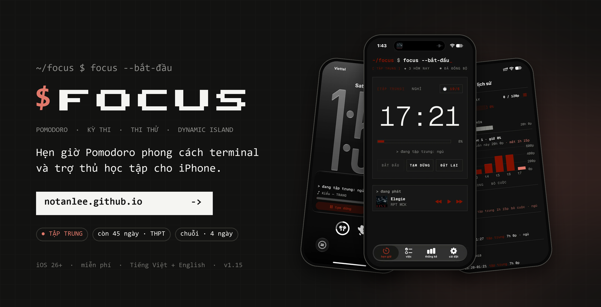
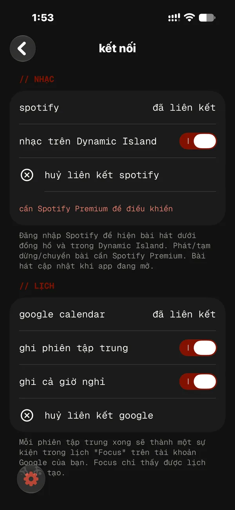

<p align="center">
  <a href="https://notanlee.github.io/"></a>
</p>

<p align="center">
  <b>Hẹn giờ Pomodoro trông như terminal, và không để bạn bỏ cuộc dễ dàng.</b>
</p>

<p align="center">
  <a href="https://github.com/notanlee/focus-timer/releases/latest">Tải về</a> &nbsp;·&nbsp;
  <a href="https://notanlee.github.io/install">Cài đặt</a> &nbsp;·&nbsp;
  <a href="https://notanlee.github.io/">Trang web</a>
  <br>
  <sub><a href="README.md">English</a> &nbsp;|&nbsp; <b>Tiếng Việt</b></sub>
</p>

<table align="center">
  <tr>
    <td align="center"><br><sub>hẹn giờ</sub></td>
    <td align="center"><br><sub>thống kê &amp; lịch sử</sub></td>
    <td align="center"><br><sub>màn hình khoá &amp; island</sub></td>
  </tr>
</table>

## App làm được gì

- Phiên tập trung và nghỉ, mỗi phiên tới 8 tiếng, kèm các mẫu giờ của riêng bạn
- Danh sách việc gọn nhẹ; chạm một lần là bắt đầu tập trung vào việc đó
- Giữ nút đặt lại giữa phiên là màn hình báo động hiện ra can bạn bỏ cuộc
- Đếm ngược trực tiếp trên Dynamic Island và màn hình khoá
- Năm phong cách terminal, 20 phông chữ đơn cách, biểu tượng app đồng bộ theo
- Tuỳ chọn điều khiển Spotify, ghi vào Google Calendar và đồng bộ (mã 6 số qua email)
- Miễn phí, không quảng cáo, chạy không cần mạng, đầy đủ tiếng Việt và tiếng Anh

## Có gì mới trong 1.15

- **Lộ trình ôn thi tự động**: nhập ngày thi, Focus lập kế hoạch học mỗi tuần và tự điều chỉnh, dành nhiều thời gian hơn cho môn còn yếu
- **Nhật ký bỏ cuộc**: khi bỏ dở một phiên, bạn chọn lý do; tab thống kê cho thấy lý do hay gặp nhất, khung giờ dễ bỏ cuộc nhất và một lời khuyên
- **Hướng dẫn thiết lập và tham quan mới**, dẫn bạn qua từng phần của app trong lần mở đầu tiên

<sub>Từ bản 1.14: đếm ngược kỳ thi, hẹn giờ thi thử, môn học kèm mục tiêu mỗi ngày và chuỗi ngày, âm thanh tập trung, thanh tab ở dưới.</sub>

<details>
<summary><b>Thêm ảnh chụp màn hình</b></summary>
<br>
<table align="center">
  <tr>
    <td align="center"><br><sub>việc cần làm</sub></td>
    <td align="center"><br><sub>màn hình báo động</sub></td>
    <td align="center"><br><sub>đếm ngược kỳ thi</sub></td>
  </tr>
  <tr>
    <td align="center"><br><sub>thi thử</sub></td>
    <td align="center"><br><sub>môn học</sub></td>
    <td align="center"><br><sub>âm thanh tập trung</sub></td>
  </tr>
  <tr>
    <td align="center"><br><sub>chặn xao nhãng</sub></td>
    <td align="center"><br><sub>spotify</sub></td>
    <td align="center"><br><sub>google calendar</sub></td>
  </tr>
</table>
</details>

## Cài đặt

1. Tải tệp `.ipa` mới nhất ở mục [bản phát hành](https://github.com/notanlee/focus-timer/releases/latest).
2. Cài bằng iloader hoặc SideStore theo [hướng dẫn cài đặt](https://notanlee.github.io/install) (Windows hoặc Mac, mất khoảng 10 phút).
3. Mở Focus. App sẽ báo khi có bản cập nhật mới.

Để cập nhật bằng một lần chạm trong SideStore, thêm nguồn này:

```
https://github.com/notanlee/focus-timer/releases/latest/download/source.json
```

<sub>Cần iOS 26 trở lên. Bản cài bằng Apple Account miễn phí dùng được 7 ngày; hãy làm mới bằng iloader hoặc SideStore.</sub>

## Câu hỏi thường gặp

<details>
<summary><b>App có miễn phí không?</b></summary>

Có. Không quảng cáo, không gói trả phí, không mua trong app.
</details>

<details>
<summary><b>Có cần tài khoản không?</b></summary>

Không. Focus chạy không cần mạng ở chế độ khách. Tài khoản là tuỳ chọn (mã 6 số qua email, không cần mật khẩu), dùng để sao lưu và đồng bộ việc cần làm và lịch sử.
</details>

<details>
<summary><b>Sao app không có trên App Store?</b></summary>

Đây là dự án cá nhân miễn phí, nên bạn tự cài (sideload) bằng Apple Account miễn phí. [Hướng dẫn cài đặt](https://notanlee.github.io/install) có đủ từng bước.
</details>

<details>
<summary><b>App thu thập dữ liệu gì?</b></summary>

Chỉ những gì cần để đồng bộ việc và phiên của chính bạn. Kỳ thi, mục tiêu, âm thanh và cài đặt nằm trên máy bạn. Xem [Chính sách bảo mật](https://notanlee.github.io/privacy).
</details>

## Góp ý

Mở một [issue](https://github.com/notanlee/focus-timer/issues), hoặc nhắn **Discord** `notanlee` / **TikTok** [`@notanlee1`](https://www.tiktok.com/@notanlee1).

## Bản quyền

Bản quyền © 2026 An Le. Bảo lưu mọi quyền ([LICENSE](LICENSE), bản tiếng Anh là bản chính thức). Ứng dụng được tải và dùng miễn phí; mã nguồn được giữ riêng tư và không được sao chép, chỉnh sửa hay phân phối lại. Xem [Điều khoản](https://notanlee.github.io/terms).

```bash
creator note:
hoi chieu....... hoio chieuuuuuuuuuuuuuuuuuuuuuuuuuuuuuuuuuuu t-t--t-t-t-t-t-t-t-tt-t-t-t-t-t-t-troi m-m-m--mm-m-m-m-m-m-mua
```
