<p align="center">
  <a href="https://sus1234trwtw.github.io/">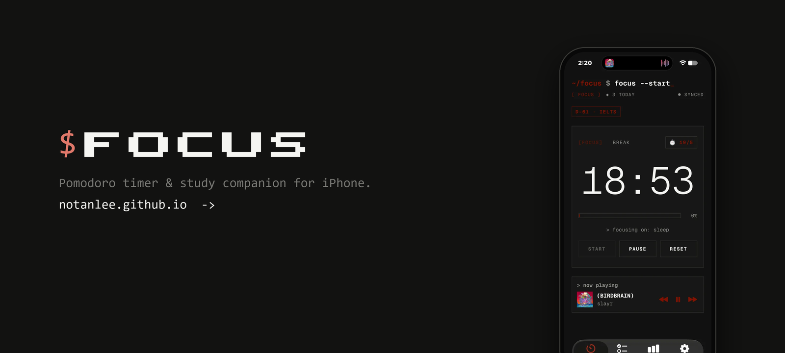</a>
</p>

<p align="center">
  <a href="README.md"></a>
  <a href="README.vi.md"></a>
</p>

<h1 align="center">$ Focus</h1>

<p align="center">
  <b>Hẹn giờ Pomodoro trông như terminal, và không cho bạn bỏ cuộc dễ dàng.</b><br>
  Làm cho học sinh: đếm ngược kỳ thi, thi thử, môn học, chuỗi ngày học.
</p>

<p align="center">
  <a href="https://github.com/SuS1234trwtw/focus-timer/releases/latest"></a>
  <a href="https://github.com/SuS1234trwtw/focus-timer/releases"></a>
  
  
  <a href="https://sus1234trwtw.github.io/"></a>
</p>

<p align="center">
  <a href="https://github.com/SuS1234trwtw/focus-timer/releases/latest"><b>Tải IPA</b></a> &nbsp;·&nbsp;
  <a href="https://sus1234trwtw.github.io/install.html"><b>Hướng dẫn cài</b></a> &nbsp;·&nbsp;
  <a href="https://sus1234trwtw.github.io/"><b>Website</b></a> &nbsp;·&nbsp;
  <a href="https://github.com/SuS1234trwtw/focus-timer/releases">Ghi chú phát hành</a> &nbsp;·&nbsp;
  <a href="https://sus1234trwtw.github.io/privacy.html">Quyền riêng tư</a> &nbsp;·&nbsp;
  <a href="https://sus1234trwtw.github.io/terms.html">Điều khoản</a>
</p>

```console
~/focus $ focus --bắt-đầu
[ TẬP TRUNG ]  ◆ 3 hôm nay  · đã đồng bộ
còn 45 ngày · THPT     thi thử · THPT Toán 90'
            1:29:59
[███░░░░░░░░░░░░░░░░░]  12%
> đang tập trung: ôn Toán chương 3   ♪ mưa · 40%
```

<p align="center">
  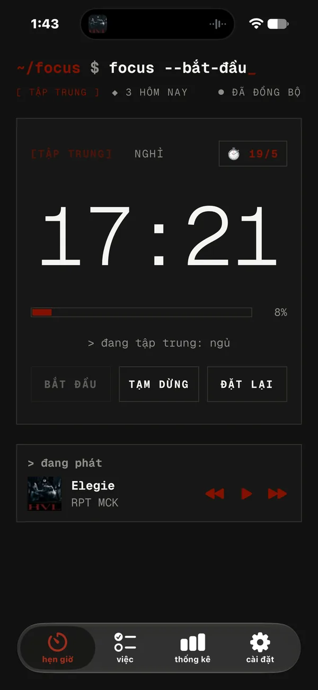
  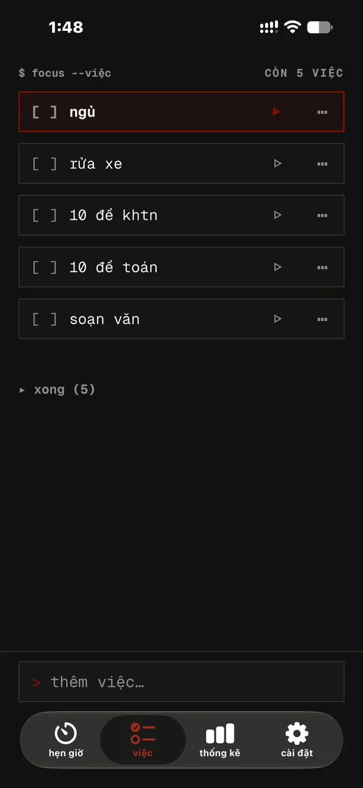
  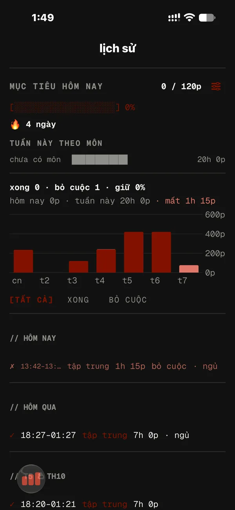
  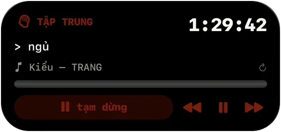
</p>

---

## Vì sao chọn $ Focus

- **Trông như terminal thật.** Năm phong cách (Mono, Cozy, PowerShell, CMD, Ubuntu), 20 phông mono; mỗi kiểu có màn hình khởi động, nút bấm và màn hình "sập" riêng.
- **Bỏ cuộc là chuyện khó.** Giữ nút đặt lại giữa phiên là màn hình báo động hiện ra can ngăn. Vẫn bỏ? Phiên đó được ghi là thất bại.
- **Làm ra để học.** Đếm ngược THPT, IELTS, SAT, làm bài thi thử bấm giờ, thống kê thời gian theo môn và giữ chuỗi ngày đạt mục tiêu.
- **Hiện ngay trên màn hình khoá.** Dynamic Island và Live Activity có nút tạm dừng, chuyển chế độ và điều khiển nhạc.
- **Miễn phí, không quảng cáo, không bắt buộc tài khoản.** Mọi thứ chạy offline; tài khoản (mã 6 số qua email) chỉ để sao lưu và đồng bộ.

## Có gì mới trong 1.14

| | |
|---|---|
| **Đếm ngược kỳ thi** | Thêm THPT Quốc gia, IELTS, SAT, VSAT/ĐGNL, cuối kỳ hoặc kỳ thi của bạn. Kỳ gần nhất hiện thành `còn 45 ngày · THPT`, nhắc trước một tuần và một ngày. |
| **Hẹn giờ thi thử** | Đúng thời lượng đề thật: THPT Toán 90', Văn 120', Anh 60'; IELTS Nghe/Đọc/Viết; SAT. Báo trước 15' và 5' khi sắp hết giờ. |
| **Môn học & thống kê** | Gắn môn cho việc (Toán, Văn, Anh…). Tab thống kê có mục tiêu mỗi ngày, chuỗi ngày 🔥 và số phút theo môn. |
| **Âm thanh tập trung** | Mưa, biển, quạt, tiếng ồn trắng/hồng/nâu, tạo ngay trên máy. Vẫn phát khi khoá màn hình và hoà cùng Spotify. |
| **Giao diện mới** | Thanh tab ở dưới (Hẹn giờ · Việc · Thống kê · Cài đặt), màu dịu và ấm hơn, đổi tên thành **$ Focus**. |

<p align="center">
  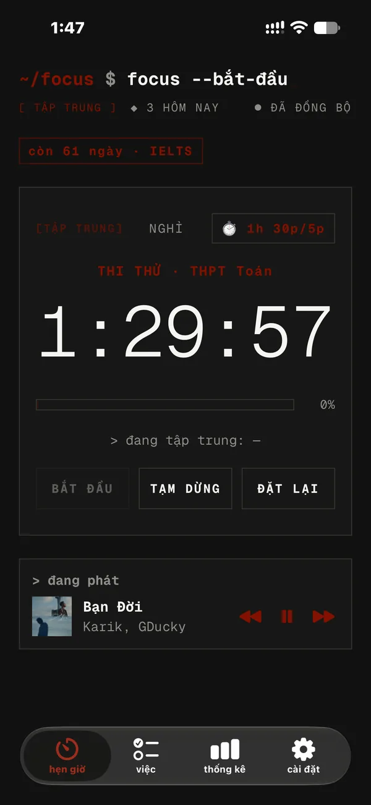
  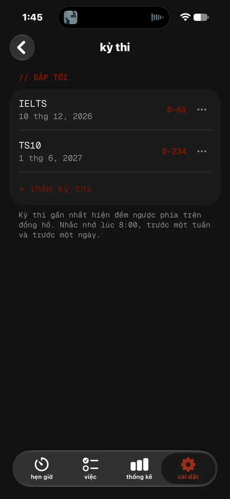
  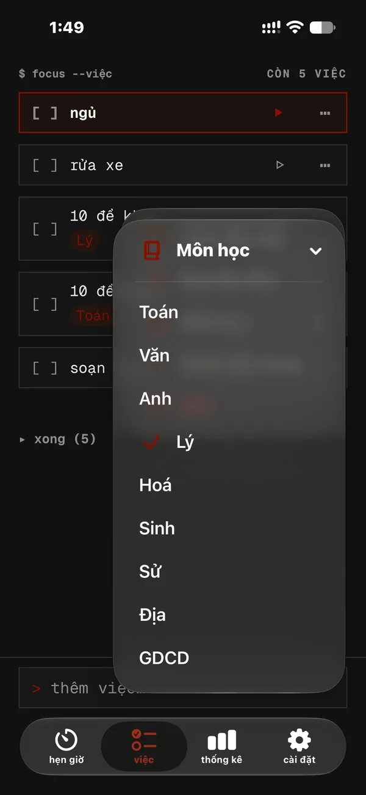
  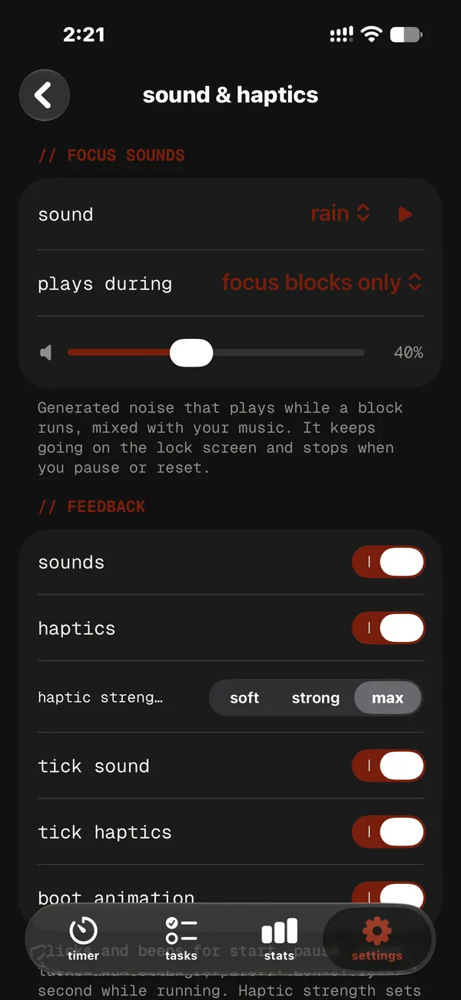
</p>

## Mọi thứ app làm được

<table>
<tr>
<td width="50%" valign="top">

**Hẹn giờ**
- Tập trung / nghỉ tới 8 giờ mỗi loại, chọn bằng bánh xe giờ/phút hoặc nút nhanh
- Preset của riêng bạn, nút ⏱ ngay trên đồng hồ
- Giữ để tạm dừng; giữ lâu để đặt lại giữa phiên → màn hình báo động
- Âm thanh và rung Core Haptics cho mọi thao tác

**Việc cần làm**
- Thêm việc từ thanh ghim ở cuối màn hình
- ▷ để tập trung, ⋯ để chọn môn / đưa lên đầu / xoá
- Việc đã xong gom vào "xong (n)", kéo để sắp xếp

**Học tập**
- Thẻ đếm ngược kỳ thi + lời nhắc
- Hẹn giờ thi thử có báo sắp hết giờ
- Môn học, mục tiêu mỗi ngày, chuỗi ngày, số phút theo môn
- Lịch sử phiên hoàn thành ✓ và bỏ cuộc ✗

</td>
<td width="50%" valign="top">

**Màn hình khoá & island**
- Đếm ngược trực tiếp trên Dynamic Island và màn hình khoá
- Tạm dừng, chuyển tập trung ↔ nghỉ, ⏮ ⏯ ⏭ cho Spotify
- Chạm dòng bài hát để làm mới

**Chặn xao nhãng**
- Chặn app gây phân tâm khi tập trung (qua Phím tắt)
- Bật Không làm phiền khi tập trung, tắt khi nghỉ

**Kết nối**
- Bài đang phát và điều khiển Spotify
- Ghi các phiên đã xong vào Google Calendar
- Sao lưu & đồng bộ bằng mã 6 số qua email

**Tuỳ chỉnh theo ý bạn**
- 5 phong cách terminal, 20 phông, màu tuỳ chọn, biểu tượng app đi kèm
- Tiếng Việt và English, dịch toàn bộ

</td>
</tr>
</table>

<p align="center">
  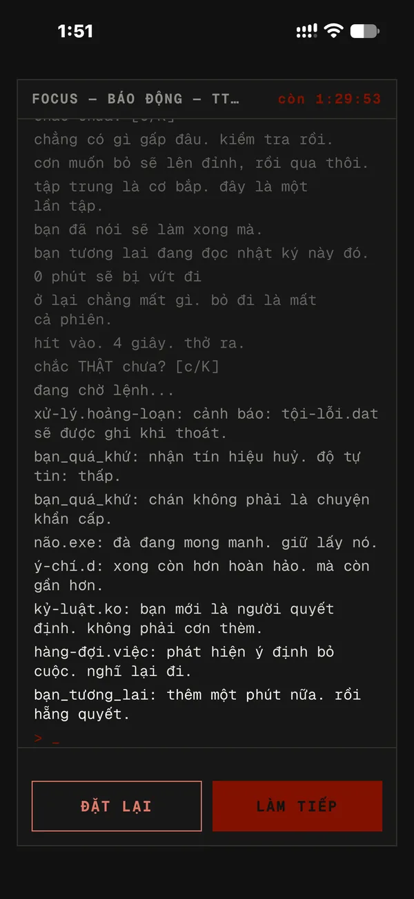
  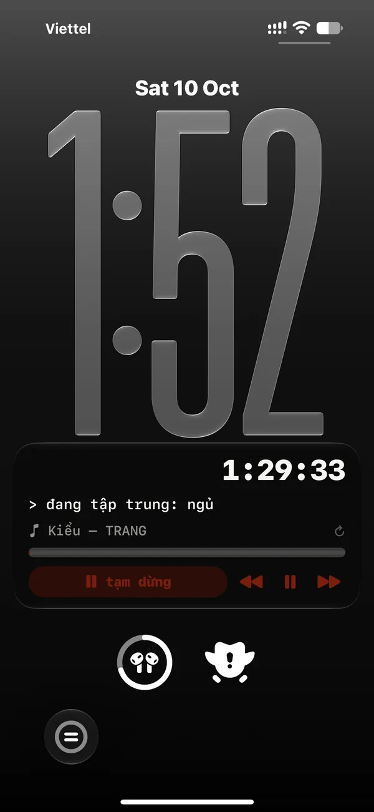
  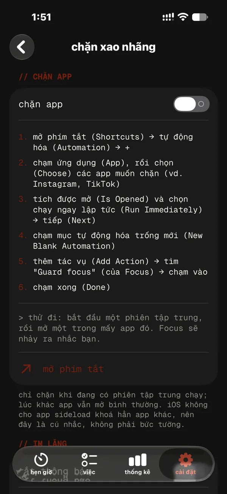
  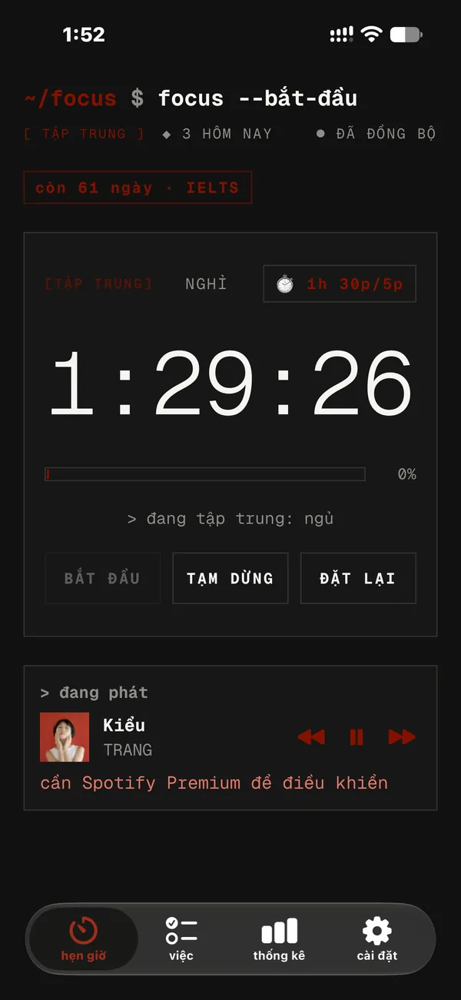
</p>

## Cài đặt

Focus không có trên App Store; bạn cài bằng Apple ID miễn phí (sideload).

1. **Tải** file `FocusTimer-<phiên bản>-<build>.ipa` mới nhất ở [Releases](https://github.com/SuS1234trwtw/focus-timer/releases/latest).
2. **Cài** bằng iloader hoặc SideStore theo [hướng dẫn từng bước](https://sus1234trwtw.github.io/install.html) (Windows hoặc Mac).
3. **Cập nhật**: app tự báo khi có bản mới. Trong SideStore, thêm nguồn này để cập nhật một chạm:

```
https://github.com/SuS1234trwtw/focus-timer/releases/latest/download/source.json
```

> Cần iOS 26 trở lên. Bản cài bằng Apple ID miễn phí dùng được 7 ngày, sau đó làm mới trong iloader hoặc SideStore.

## Câu hỏi thường gặp

<details>
<summary><b>App có miễn phí không?</b></summary>

Có. Không quảng cáo, không đăng ký trả phí, không mua trong app.
</details>

<details>
<summary><b>Có cần tài khoản không?</b></summary>

Không. Focus chạy đầy đủ offline ở chế độ khách. Tài khoản tuỳ chọn (đăng nhập bằng mã 6 số qua email) sao lưu việc và lịch sử, đồng bộ giữa các máy.
</details>

<details>
<summary><b>App có chạy offline không?</b></summary>

Có. Chỉ đồng bộ, Spotify và Google Calendar cần mạng.
</details>

<details>
<summary><b>Sao bài hát trên Dynamic Island đôi khi cập nhật chậm?</b></summary>

iOS không cho app cài ngoài chạy nền liên tục. Focus kiểm tra lại Spotify khoảng 30 giây sau khi bạn rời app và mỗi khi bạn bấm nút trên island hoặc chạm dòng bài hát.
</details>

<details>
<summary><b>App thu thập dữ liệu gì?</b></summary>

Chỉ những gì cần để đồng bộ việc và phiên của chính bạn. Kỳ thi, mục tiêu, âm thanh và cài đặt nằm trên máy bạn. Xem [Chính sách quyền riêng tư](https://sus1234trwtw.github.io/privacy.html).
</details>

## Ghi chú phát hành

Mỗi phiên bản đều có trong mục [Releases](https://github.com/SuS1234trwtw/focus-timer/releases), ghi rõ tính năng mới, thay đổi và lỗi đã sửa, bằng tiếng Anh và tiếng Việt.

## Góp ý

Mở một [issue](https://github.com/SuS1234trwtw/focus-timer/issues), hoặc nhắn **Discord** `notanlee` / **TikTok** [`@notanlee1`](https://www.tiktok.com/@notanlee1).

## Bản quyền

Copyright © 2026 An Le. Bảo lưu mọi quyền ([LICENSE](LICENSE), bản tiếng Anh là bản chính thức). Ứng dụng được tải và dùng miễn phí; mã nguồn được giữ riêng tư và không được sao chép, chỉnh sửa hay phân phối lại.

```bash
creator note:
hoi chieu....... hoio chieuuuuuuuuuuuuuuuuuuuuuuuuuuuuuuuuuuu t-t--t-t-t-t-t-t-t-tt-t-t-t-t-t-t-troi m-m-m--mm-m-m-m-m-m-mua
```
